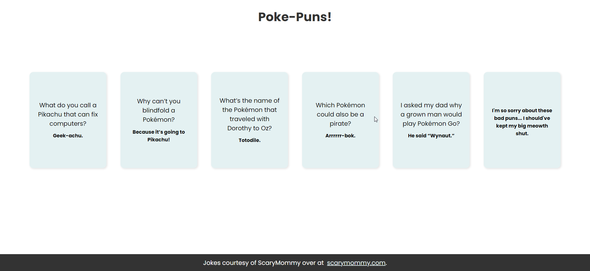

# Solo 02 - Joke Components

    

**Challenge**:

- Render 4-5 <Joke/> components.
- Each joke should take a "setup" prop, and a "punchline" prop.

**Extra Credit**:

- Use some jokes, that are only a punchline, and no setup, like "It's hard to explain puns to kleptomaniacs because they always take things literally"

## Things to consider:

- This was the second solo project of the course. The prompt above was all I was given, then had free range from there.
- Utilizes props in the components to pupulate each card.
- Jokes were pulled from [ScaryMommy.com](https://www.scarymommy.com/pokemon-puns-jokes). They are Pokemon themed!

## React + Vite

This template provides a minimal setup to get React working in Vite with HMR and some ESLint rules.

Currently, two official plugins are available:

- [@vitejs/plugin-react](https://github.com/vitejs/vite-plugin-react/blob/main/packages/plugin-react/README.md) uses [Babel](https://babeljs.io/) for Fast Refresh
- [@vitejs/plugin-react-swc](https://github.com/vitejs/vite-plugin-react-swc) uses [SWC](https://swc.rs/) for Fast Refresh
